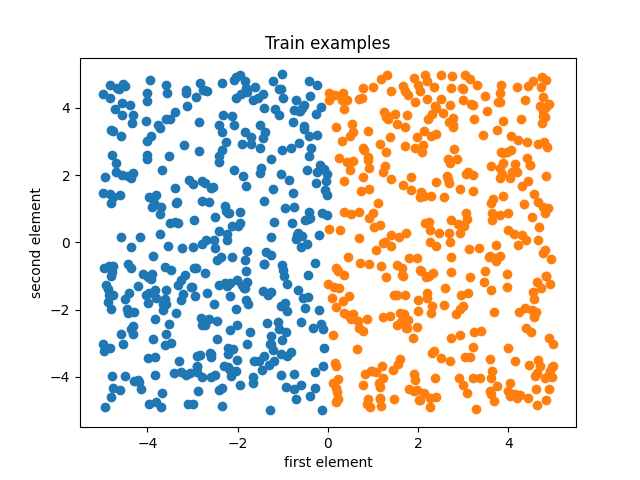
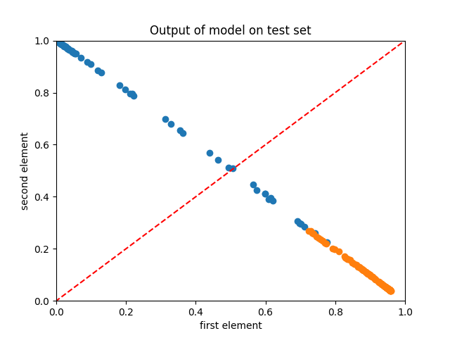

# Simple NN

An extremely simple neural network written purely using Python and NumPy, and with detailed comments, docstring and type-hinting, made for educational purposes.

Some design choices were adapted from PyTorch, because in the end we would be using PyTorch, so understanding the implementation of it would be good.

## Execution

The following commands should be executed under `src` folder.

Generate data: `python gen_data.py`

Visualize training data: `python visualize.py`

Train: `python train.py`

> By default, after training and testing, the code will automatically visualize the model by plotting the outputting vectors of the test set.

## Hyperparameters

The implementation is supposed to be as simple as possible while maintaining the main features of a PyTorch program, thus, there are basically only two training hyperparameters: epoch and learning rate. They are found in the beginning of the `train` function in `train.py`.

## Visualization

For educational purposes, I have included a visualizer that visualizes features on a 2D plot. The following images are, respectively, training examples and the output of the trained model on the test set.

## Developer's Note

Currently, the network isn't good enough on XOR task. But the scale of the architecture should be enough to model XOR, I think it's just the hyperparameters that are not working.

